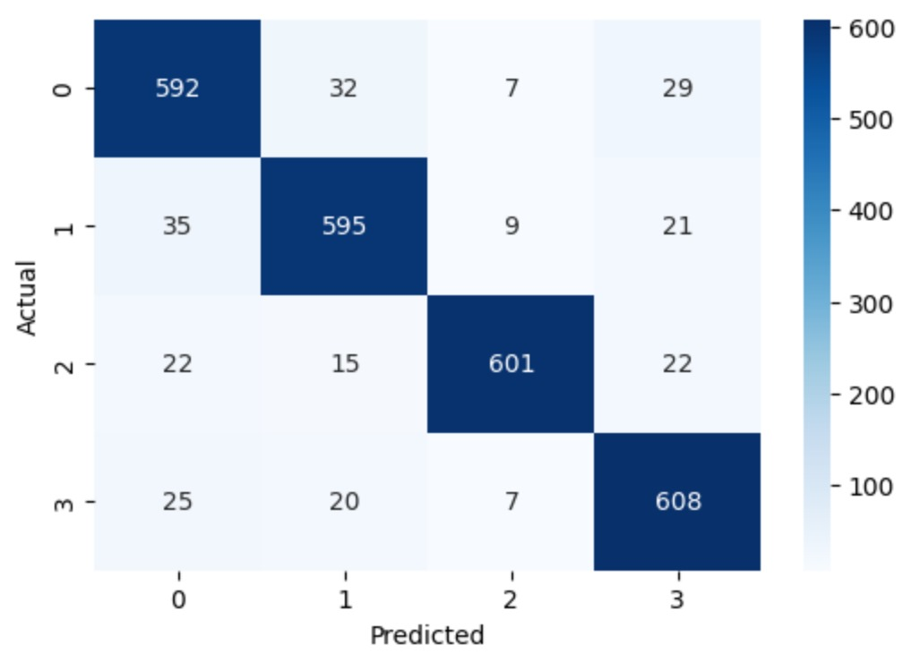

# Weather-Forecast
# AI Weather Predictor & Forecast Dashboard

This project is a Streamlit-based web application that predicts current weather conditions using real-time data and forecasts the next 7 days of weather using a combination of Random Forest and ARIMA models.

## Features

- Real-Time Weather Prediction  
  Predicts current weather (like rain, sun, fog, etc.) using OpenWeatherMap data and a trained Random Forest model.

- Historical Weather Trends  
  Visualizes historical weather data (Temperature, Humidity, Precipitation) using Visual Crossing Weather API.

- 7-Day Weather Forecast  
  Uses the ARIMA time series model to forecast weather parameters for the next 7 days, followed by classification using the Random Forest model.

- Future Trend Visualization  
  Forecasted trends for Temperature, Humidity, and Precipitation are displayed in an interactive line chart, similar to historical data visualization.

## Models Used

- Random Forest Classifier  
  Trained to predict weather conditions based on weather parameters such as temperature, humidity, wind speed, precipitation, pressure, UV index, and visibility.

- ARIMA (AutoRegressive Integrated Moving Average)  
  Used for time-series forecasting of numeric weather features (Temperature, Humidity, Precipitation, and Wind Speed).

The confusion matrix of this model is shown below:



> This matrix represents the classification performance of the Random Forest model on weather condition prediction.

## Tech Stack

- Python
- Streamlit
- scikit-learn
- statsmodels (ARIMA)
- OpenWeatherMap API
- Visual Crossing Weather API
- Pandas, NumPy, Matplotlib

## Files Required to Run

- `weather_model.pkl` – Trained Random Forest model
- `scaler.pkl` – Preprocessing scaler (e.g., StandardScaler or MinMaxScaler)
- `label_encoder.pkl` – Encodes the weather condition labels
- Main Python Script – Your `app.py` (or similar) Streamlit code
- Internet connection for API calls


##  How to Run the Project

### 1. Clone the Repository

```
git clone https://github.com/your-username/weather-predictor.git
cd weather-predictor
```
2. Install Dependencies
```
pip install -r requirements.txt
```
3. Run the Streamlit App
```
streamlit run weather.py
```
